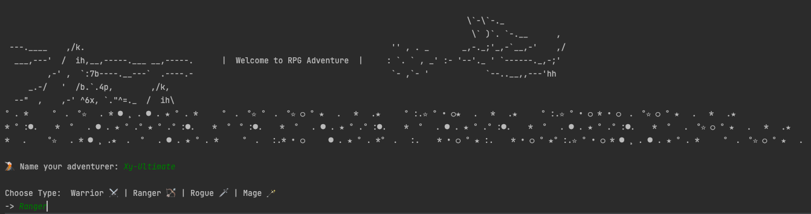

# RPG Adventure 🏰🐉

RPG-Characters concept for a hypothetical RPG game.

All characters have the following properties, name, level, experience, Base Primary attributes, Total Primary attributes

### Ranger 🏹

Ranger (Bow | Leather, Mail) = Strength 1, Dexterity 7, Intelligence 1 | +1 level -> Str 1 Dex 5 Int 1 -> 1% damage

### Rogue ⚔️ ️🗡

Rogue (Dagger, Sword | Leather, Mail) = Strength 2, Dexterity 6, Intelligence 1 | +1 level -> Str 1 Dex 4 Int 1 -> 1%
damage

### Warrior ⚔️️ 🗡

Warrior (Axe, Hammer, Sword | Mail, Plate) = Strength 5, Dexterity 2, Intelligence 1 | +1 level -> Str 3 Dex 2 Int 1 ->
1% damage

### Mage 🪄

Mage (Staff, Wand | Cloth)= Strength 1, Dexterity 1, Intelligence 8 | +1 level -> Str 1 Dex 1 Int 8 -> 1% damage

### Game Functionality 🕹👾
The game and every character needs to be able to have:
- level up (assign and update the new attributes);
- wield the right equipment at the right time (InvalidWeaponException/InvalidArmorException);
- Character stats display (name, level, strength, dexterity, intelligence, weapon and total DPS, base + gear bonus);
